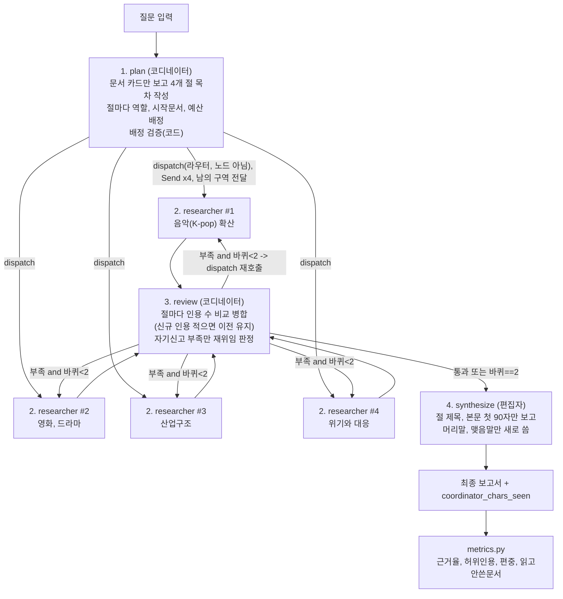
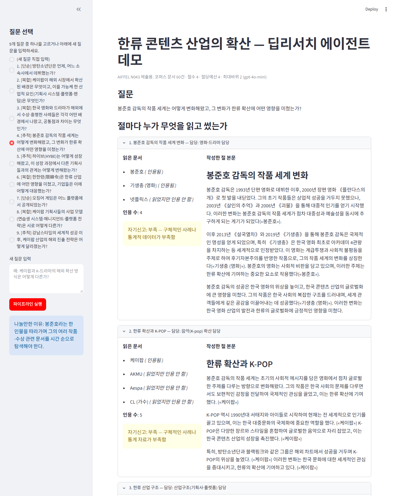

# REPORT — 한류 콘텐츠 산업의 확산 딥리서치 에이전트

AIFFEL N043 "나만의 딥리서치 에이전트 만들기" 제출 보고서. N042의 코디네이터+조사관+편집자
6노드 구조를 "한류 콘텐츠 산업의 확산"이라는 주제로 처음부터 다시 설계했다. 설계 근거의 원문은
[PLAN.md](PLAN.md)에, 실행 결과 원본은 `output/`에 있다.

## 1. 주제와 코퍼스

### 무엇을, 왜 골랐는가

주제는 **"한류 콘텐츠 산업의 확산"**이다. 좋은 주제의 3조건(N043 강의 4장)과 대조하면:

| 조건 | 충족 근거 |
|---|---|
| ① 여러 자료가 필요함 | 아티스트·기획사·작품·정책 문서가 각각 따로 존재 — 하나만 읽어서는 "왜 확산됐는가"에 답이 안 나온다 |
| ② 자료 총량이 컨텍스트 창을 넘음 | 문서 60건 × 평균 약 1만 자, 총 597,350자 → gpt-4o-mini 한 번에 다 못 읽는다 |
| ③ 문서끼리 연결 관계가 있음 | 방탄소년단→하이브→SM/JYP/YG(경쟁사), 봉준호→기생충→아카데미, 싸이→강남스타일→케이팝 등 다단계 링크가 실제로 존재한다 |

분업 단위는 **내용 단위**로 잡았다(형식 단위로 나누면 전원이 같은 문서를 읽는다는 N042의 함정을
피하기 위해): 음악(K-pop) 확산 / 영화·드라마 / 산업구조(기획사·플랫폼) / 위기와 대응(한한령 등).
각 절이 서로 다른 문서 군집(아이돌·그룹 문서 / 영화·드라마 문서 / 기획사 문서 / 정책·사건 문서)을
가리키도록 설계했다.

### 코퍼스 — 몇 건이고, 어떻게 검수했는가

한국어 위키백과 API로 시드 20건에서 2홉까지 확장해 최종 **문서 60건, 총 597,350자**를 모았다
(`collect_corpus.py`). 3,000자 미만 토막글은 제외했고, 링크는 코퍼스 안에 실제로 있는 제목만 남겼다.

**실제로 두 번 다시 모아야 했다** — 자동 수집이 "오류 없이 끝났다"는 것과 "데이터가 깨끗하다"는
것은 다르다는 N042 5장의 교훈을 그대로 재확인했다:

1. **1차 수집(60건) 사람 검수**: 제목 목록을 직접 훑어보니 위키미디어 "국민 허브"(웨이백 머신,
   X(옛 트위터)), 언어 허브(영어·일본어·한국어 — 거의 모든 문서가 "OO어로 번역" 식으로 링크를 검),
   지역 허브(서울특별시), 너무 넓은 방송사 허브(KBS·SBS — 케이팝 전용 채널인 SBS 인기가요·엠넷과
   달리 모든 장르를 다루는 방송사 자체는 제외)가 섞여 있었다. 또한 리다이렉트 표제어 차이로 내용이
   100% 동일한 문서가 두 번 저장된 사례(`YG엔터테인먼트`/`YG 엔터테인먼트`, `아이유`/`아이유 (가수)`)
   를 발견했다. `collect_corpus.py`의 스톱리스트에 반영하고, 콘텐츠 해시 기반 중복 제거 로직을
   추가한 뒤 재수집했다.
2. **2차 수집 후 재검수**: "경기도"(아이돌 출신지 각주로 걸린 일반 행정구역 허브)를 추가로 발견해
   직접 제거했다. 또한 시드 목록의 "사드 배치 논란"이 실제 위키백과 표제어가 아니어서(존재하지
   않는 제목이라 조용히 제외됨) "위기와 대응" 갈래가 통째로 비어있었다는 것을 9개 질문을 실전
   실행하다 발견했다(§6 참고) — 실제 표제어 "대한민국의 사드 배치 논란"(23,216자)으로 정정해
   재수집했다.

최종 60건 중 **`넷플릭스`·`대장금`·`대한민국의 사드 배치 논란` 세 문서는 outgoing 링크가 0개**다
— 이 문서들은 오직 코디네이터의 배정(시작문서 지정)으로만 도달 가능하고, 다른 조사관이 탐색 중
"우연히" 찾아올 수는 없다(N042 5장의 «거문도 사건» 사례와 동일한 문제). 실제로 "위기와 대응"
절에서 코디네이터가 `대한민국의 사드 배치 논란`을 정확히 배정하는 것을 확인했다(§6).

## 2. 분업 설계

### 서브에이전트 설계 규칙

- **목차 분할**: 코디네이터(`plan`)가 문서 카드(제목+앞 250자)만 보고 4개 절을 내용 단위로 나눈다.
  절마다 역할·시작문서·예산(4)을 정한다.
- **역할 명단**(`config.json`): 음악(K-pop) 확산 담당 / 영화·드라마 담당 / 산업구조(기획사·플랫폼)
  담당 / 위기와 대응 담당.
- **배정 검증**: 코디네이터가 내놓은 "시작문서"가 실제 코퍼스에 있는 제목인지 코드로 검사한다.
  없거나 이미 다른 절이 차지한 제목이면 아직 안 쓰인 실제 문서로 교체한다.
- **구역(zone)**: 조사관들을 동시에 파견(`dispatch`, LangGraph `Send`)하며 각자에게 "다른 조사관의
  시작문서" 목록("피하기")을 함께 전달해 중복 조사를 줄인다.
- **재위임**: 조사관이 스스로 "부족"을 신고한 절만 다시 조사시키며, `최대바퀴`(2)로 무한 재조사를
  막는다.
- **컨텍스트 격리**: 코디네이터는 문서 카드(제목+앞 250자, 전체 코퍼스의 일부)만 본다. 조사관은
  원문 전체가 아니라 절 본문+인용+읽은문서 목록만 상위로 올린다. 편집자(`synthesize`)는 절 제목과
  본문 첫 90자만 보고 머리말·맺음말만 새로 쓴다(절 본문 자체는 다시 쓰지 않고 이어붙인다).

### 실측 컨텍스트 격리율

9개 질문 실행에서 코디네이터가 실제로 본 글자 수(문서 카드 전체) 대비 코퍼스 총 글자 수(597,350자)
비율은 **2.73~2.79%**로 거의 일정했다(카드 길이가 문서 수×250자로 고정되어 있으므로 당연한
결과다). N042의 컨텍스트 격리율(5.0%)보다도 낮다 — 코퍼스가 더 크기 때문이다. 조사관이 실제로
읽는 문서 수(질문당 8~11건, 코퍼스의 13~18%)와 비교하면 상위 코디네이터가 보는 정보량이 하위
조사관 대비 훨씬 적다는 것을 숫자로 확인했다.

### dispatch를 노드로 등록하지 않는다

N042 실습에서 실제로 겪은 버그(`dispatch`를 노드로도 등록하고 조건부 엣지로도 등록해
`InvalidUpdateError`가 났던 사례)를 이 프로젝트는 처음부터 피했다. `graph.py`의 `build()`는
`dispatch`를 `g.add_node()`에 절대 넣지 않고, `g.add_conditional_edges("plan", dispatch, ...)`와
`route_after_review` 안에서 함수 호출로만 사용한다.

## 3. 지표

정답표도 판정 모델도 쓰지 않고, 완성된 글과 실제로 읽은 자료만으로 4개 지표를 계산한다
(`metrics.py`, N042에서 이식).

| 지표 | 의미 | 관련 장치 | 정상 범위 |
|---|---|---|---|
| 근거율 | 문장 중 실제 인용(«문서명»)이 붙은 비율 | 조사·재위임 | 높을수록 좋음(순위표 아님) |
| 허위인용 | 읽지 않은 문서를 인용한 문장 수 | 조사/인용 검증 | 0이어야 하는 경보 |
| 편중 | 인용이 특정 한 문서에 쏠린 정도 | 배정·구역 | 낮을수록 좋음 |
| 읽고 안 쓴 문서 | 읽었지만 결국 인용하지 못한 문서 수 | 배정 | 낮을수록 조사 효율 높음 |

### 9개 질문 실행 결과

| 질문 | 성격 | 근거율 | 허위인용 | 편중 | 읽고안쓴문서 |
|---|---|---|---|---|---|
| 1 | 단순 | 0.857 | 0 | 0.419 | 5 |
| 2 | 복합 | 0.571 | 0 | 0.261 | 5 |
| 3 | 복합 | 0.529 | **2** | 0.211 | 6 |
| 4 | 추적 | 0.714 | 0 | 0.545 | 9 |
| 5 | 추적 | 0.478 | 0 | 0.545 | 8 |
| 6 | 복합 | 0.429 | 0 | 0.667 | 6 |
| 7 | 단순 | 0.667 | 0 | 0.4 | 5 |
| 8 | 복합 | 0.423 | 0 | 0.333 | 5 |
| 9 | 추적 | 0.214 | 0 | 0.714 | 9 |

흥미롭게도 "단순" 질문(1, 7)이 근거율 최상위권이다 — 문서 하나로 답이 나오는 질문이라 조사관이
곁가지로 흩어지지 않고 한 문서에 집중해서 쓰기 때문으로 보인다. 이는 도구설계원칙 1("이런 문제는
6노드 구조로 풀지 않아도 된다")과도 맞아떨어진다: 근거율이 높다고 이 구조가 "더 필요하다"는
뜻은 아니다.

### 허위인용 사례 — 질문 3

질문3("한국 영화와 드라마가 해외에서 수상·흥행한 사례들…")의 "K-pop의 해외 확산과 성공 사례" 절이
`겨울연가`, `김완선`, `한류`, `Aespa` 네 문서만 읽고도 본문에서 «가을동화»·«강남스타일»을 인용했다.
확인해보니 이 두 제목은 실제로 읽은 `겨울연가` 문서 **본문 안에서 언급된** 이름이다(겨울연가는
윤석호 PD의 전작 《가을동화》의 성공을 바탕으로 제작됐고, 케이팝 확산의 대표 사례로 《강남스타일》이
자주 함께 언급된다). 완전히 지어낸 인용은 아니지만 "직접 읽은 문서" 목록 밖의 제목을 인용 표기한
경계 사례로, `metrics.py`의 집합 연산이 정확히 잡아냈다. 이 사례는 "허위인용(코드가 잡을 수 있음)"과
"오귀속(코드가 못 잡음)" 사이의 회색지대를 보여준다 — 문서 "안에서 언급된" 사실을 인용하는 것과
그 문서를 "직접 읽은" 것은 다르다는 것을 이번 실습으로 실제 확인했다.

### 오귀속(사람이 직접 읽어 확인) — 질문 4

정답표로 못 잡는 오귀속을 대표 질문 하나(질문4, 봉준호)를 손으로 직접 읽어 확인했다.

- **팀 보고서, "한류 확산과 K-pop의 영향" 절**: "봉준호 감독의 작품 세계는 초기에는 사회적 이슈를
  다루는 데 집중했으나… («케이팝»)"처럼, 봉준호의 연출 스타일 변화를 서술하는 문장 6개 전부에
  «케이팝»을 인용으로 달았다. `케이팝` 문서를 읽은 것은 사실이지만(허위인용 아님), 그 문서가
  "봉준호의 연출이 어떻게 변해왔는가"를 설명하지는 않는다 — 인용이 문장 내용과 헐겁게 붙은
  전형적인 오귀속이다.
- **대조군(baseline) 보고서**: "봉준호 감독은 사회적 문제를 개인의 이야기와 연결지어 표현함으로써,
  보다 보편적인 주제를 다루게 되었다(«대장금»)."도 같은 문제다. 《대장금》은 궁중 요리를 다루는
  드라마로 봉준호의 연출 철학 변화와 무관하다 — 팀 구조뿐 아니라 대조군에서도 오귀속이 나온다는
  것을 확인했다.

두 사례 모두 근거율·허위인용 지표로는 전혀 잡히지 않는다(읽은 문서를 인용했으므로 "정상"으로
집계됨). N042·N043 두 문서 모두 이 한계를 명시하는데, 이번 실습에서도 정확히 같은 패턴이
재현됐다.

## 4. 파이프라인 구조도



**State**: `question`(질문) · `toc`(목차, plain 필드) · `sections`(절 원고 리스트, `Annotated[list, operator.add]`로
병렬 조사관 결과를 누적) · `wheel`(재위임 바퀴 수) · `report`(최종 보고서) ·
`coordinator_chars_seen`(`Annotated[int, operator.add]`, 컨텍스트 격리율 계산용) ·
`redelegation_log`(재위임 시 원고 처리 결정 로그, review가 매번 전체 재계산해 덮어씀).

## 5. 데모 설계

`app.py`(streamlit)는 질문 9개 중 하나를 고르거나 새 질문을 입력해 파이프라인을 실행할 수 있다.
가장 신경 쓴 부분은 N043 14장의 지침 — **"숫자만 보여주는 화면은 이 프로젝트의 요점을 놓친다"**다.
그래서 절마다 다음을 한 화면에 함께 보여준다:

- 담당 역할(누가)
- 읽은 문서 목록, 그리고 각 문서가 "인용됨"인지 "읽었지만 인용 안 함"인지(무엇을 읽었는가)
- 작성한 절 본문 전체(무엇을 썼는가)
- 자기신고 "부족" 여부와 사유
- 재위임이 있었다면 원고 처리 정책 로그(이전 유지/신규 교체, 인용 수 비교)
- 마지막에 4개 지표 + 컨텍스트 격리율

로컬에서 `streamlit run app.py`로 직접 띄우고 질문 4번(추적: 봉준호)을 선택해 파이프라인을
끝까지 실행한 뒤 화면을 캡처했다(`demo_screenshot.png`, playwright+chromium으로 캡처 — Claude
Browser 도구의 스크린샷은 대화창에 인라인으로만 뜨고 파일로 남지 않아서 별도 도구를 썼다).



## 6. 프로젝트 회고

### 가장 공들인 부분 — "직접 돌려보고 이상한 지점을 거꾸로 추적"

이 프로젝트에서 가장 시간을 많이 쓴 부분은 코드를 처음 짜는 것이 아니라, **실제로 9개 질문을
다 돌려본 뒤 결과가 이상한 지점을 역추적**한 것이었다. 실행 중 실제로 발견하고 고친 문제 4건:

1. **시드 오타**: `"사드 배치 논란"`이 실제 위키백과 표제어가 아니어서(존재하지 않아 `get_extract`가
   조용히 `None`을 반환) "위기와 대응" 갈래가 코퍼스에서 통째로 비어 있었다. 실제 표제어
   `"대한민국의 사드 배치 논란"`(23,216자)으로 정정.
2. **관련성 판단이 지나치게 엄격**: 처음엔 read_one()이 "절 주제와 정확히 겹치는 내용만" 요약하게
   시켰더니, SM/JYP/YG 기획사 문서 본문을 실제로 읽고도(예: JYP 문서에 "매니지먼트 시스템" 언급이
   있음에도) gpt-4o-mini가 거의 전부 "관련 없음"이라 답해 **9개 질문 중 7개가 근거율 0%로 실패**했다.
   기준을 완화(배경, 근거로 조금이라도 도움이 되면 요약)하되 "문서에 없는 내용은 지어내지 마라"는
   제약은 유지했다. 대조군(`baseline.py`)에도 동일 기준을 적용해 공정성을 지켰다.
3. **긴 문서에서 핵심어가 앞부분에 없음**: `대한민국의 사드 배치 논란`(23,216자) 문서는 "한한령"이라는
   단어가 22,763번째 글자, 즉 문서 거의 끝에서야 등장한다. 문서 앞 6,000자만 보여주는 고정 발췌로는
   절대 이 부분에 도달할 수 없었다. 질문/절 제목에서 뽑은 핵심어가 앞부분에 없으면 문서 뒷부분에서
   찾아 주변 문맥을 덧붙이는 `build_excerpt()`를 추가했다(길이순으로 더 구체적인 핵심어부터 검색 —
   짧고 흔한 단어("대응" 등)를 먼저 찾으면 엉뚱한 곳에 걸리는 문제를 겪고 나서 고쳤다).
4. **지표 계산기가 재위임 정책을 무시**: `metrics.py`가 재위임 시 "인용 수가 줄면 이전 원고 유지"
   정책과 무관하게 단순히 "마지막 원고"로 덮어써 지표를 계산하고 있었다 — `graph.py`가 실제로
   채택한 원고와 다른 원고를 채점하는 모순이었다(질문4에서 실제 재현: 최종 보고서엔 인용 5, 6개짜리
   절이 들어갔는데 지표는 근거율 0으로 계산됨). `graph.py`의 `merge_sections()`를 그대로 재사용하도록
   고쳤다.

이 네 가지 모두 코드를 읽기만 해서는 안 보였고, 실제로 실행해서 결과가 이상하다는 것을 알아챈
뒤에야 원인을 찾을 수 있었다 — N042·N043 두 문서가 공통으로 강조하는 교훈을 그대로 재확인했다.

### 재위임 원고 처리 정책 — 결정과 구체 사례

N042는 재위임 시 "무조건 최신본으로 덮어쓴다"를 기본값으로 썼지만, 이 프로젝트는 **인용 수가
줄어들면 이전 원고를 유지하고, 늘어나거나 같으면 새 원고로 교체**하는 정책을 직접 설계했다
(`graph.py`의 `merge_sections()`).

**구체 사례(질문2, "한류와 드라마의 영향" 절)**: 1차 조사에서 인용 9개짜리 원고가 나왔다. 재위임
1바퀴 후 인용 5개짜리, 2바퀴 후 인용 4개짜리 원고가 각각 나왔지만, 두 번 모두 "이전_원고_유지"로
판정되어 **최종 보고서에는 처음의 9개 인용 원고가 그대로 남았다**. 만약 N042처럼 무조건 최신본으로
덮어썼다면 인용 9개짜리의 훨씬 근거가 풍부한 원고가 인용 4개짜리로 조용히 대체됐을 것이다.

**또 다른 사례(질문4, "봉준호 감독의 작품 세계 변화" 절)**: 1차에서 인용 5개짜리 원고가 나왔지만
조사관이 스스로 "구체적 사례·통계 부족"이라며 재위임을 요청했다. 재위임 1, 2바퀴 모두 실제로는
관련 문서를 못 찾아 인용 0개("관련 자료를 찾지 못했습니다")짜리 원고가 나왔다 — 정책이 없었다면
이 절은 최종 보고서에서 **통째로 사라졌을 것**이다. 정책 덕분에 1차의 온전한 원고가 그대로 남았다.

### Ablation 결과 — 변동폭을 먼저 보고, 단정하지 않는다

대표 질문 2건(복합=질문2, 추적=질문4) x 설정 5개(기본/배정 끄기/역할 끄기/재위임 끄기/구역 끄기)
x 3회 반복, 총 30회 실행(`output/ablation.json`에 원본 값 전부 보존).

| 설정 | 질문2 근거율(3회) | 질문4 근거율(3회) |
|---|---|---|
| 기본(전부 켜짐) | 0.417, 0.522, 0.556 | 0.273, 0.368, 0.583 |
| 배정 끄기(랜덤 시작문서) | 0.444, 0.56, 0.321 | 0.375, 0.0, 0.444 |
| 역할 끄기(전 절 동일 역할) | 0.478, 0.366, 0.462 | 0.692, 0.55, 0.2 |
| 재위임 끄기(최대바퀴=0) | 0.417, 0.56, 0.464 | 0.619, 0.5, 0.615 |
| 구역 끄기(피하기 리스트 비움) | 0.619, 0.556, 0.476 | 0.5, 0.667, 0.278 |

**헤드라인과 캐비어트**: 같은 설정도 근거율이 질문2에서 0.32~0.62, 질문4에서는 **0.0~0.69**까지
흔들린다(변동폭이 최대 0.49 — N042 12장이 경고한 "십몇%p 변동"보다 훨씬 크다). 대부분의 설정 간
평균 차이는 이 반복 간 변동폭보다 작거나 비슷한 수준이어서, "재위임을 껐더니 근거율이 올랐다"거나
"역할을 껐더니 좋아졌다"는 식으로 **단정할 근거가 없다**. 이는 오히려 이번 프로젝트가 스스로
증명한 핵심 교훈이다 — 한 두 번 실행으로 "이 장치 덕분에 좋아졌다"고 말하면 안 된다.

다만 **배정 끄기(랜덤 시작문서)**만은 근거율 외의 다른 지표에서 일관된 신호를 보였다: 질문4에서
편중이 최대 1.0(전체 인용이 단 하나의 문서에 쏠림)까지 나왔고, 읽고안쓴문서 수도 9~10건으로
다른 모든 설정(대개 3~8건)보다 체계적으로 높았다. 근거율 하나만으로는 판단할 수 없지만, 편중,
읽고안쓴문서 두 지표가 함께 같은 방향을 가리킨다는 점에서 "무작위 배정은 조사 효율을 떨어뜨린다"는
관찰은 상대적으로 신뢰도가 높다고 판단한다. 역할 끄기 설정에서 허위인용이 한 번(질문4, 2차 반복)
4건 튄 것도 눈에 띄지만, 나머지 두 반복은 0건이라 단일 사례로 결론 내리지 않는다.

### 공정한 대조군 비교

`baseline.py`는 팀과 동일한 코퍼스, 모델(gpt-4o-mini), 읽기 예산(4절x4예산=16건)을 쓰는 단일
에이전트다. 두 질문 모두 **예산 16건을 전부 소진**했다(중간에 멈추지 않음 — 대조군 손발을 묶어
놓고 이겼다고 말하는 함정을 피함).

| 질문 | 팀 근거율 | 대조군 근거율 | 팀 편중 | 대조군 편중 |
|---|---|---|---|---|
| 2(복합) | 0.571 | 0.556 | 0.261 | 0.2 |
| 4(추적) | 0.714 | 0.217 | 0.545 | 0.4 |

질문2는 팀과 대조군이 비슷한 수준이다 — 이 질문은 "기획사 시스템, 플랫폼, 팬덤"처럼 이미 내용
갈래가 뚜렷해서, 혼자 하는 BFS도 비교적 잘 흩어져 읽은 것으로 보인다. 질문4(추적형, 봉준호라는
한 인물을 따라가야 함)는 팀이 뚜렷하게 높다 — 대조군의 실제 보고서를 직접 읽어보니, 단일
에이전트가 "한류" 루트에서 BFS로 뻗어나가다 보니 봉준호 자체보다 대장금, 기타 인물 쪽으로 읽기가
분산되어(§3 오귀속 사례가 그 증거) 봉준호의 "변화 과정"을 추적하는 질문의 핵심에서 살짝 벗어난
반면, 팀 구조는 절 하나를 "봉준호 감독의 작품 세계 변화"로 명시적으로 떼어놓아 그 절 담당
조사관이 봉준호, 기생충 문서에 집중할 수 있었다. 다만 이 역시 각 1회 실행 결과이므로, ablation의
교훈과 마찬가지로 "추적형 질문에는 팀 구조가 항상 이긴다"고 일반화하지는 않는다.

### 도구설계원칙(config.json) 7개 항목이 실제로 어떻게 적용됐는가

| # | 원칙 | 이 코드에서 |
|---|---|---|
| 1 | 언제 쓰지 않는지 | 질문 1, 7(단순)은 실제로 근거율이 가장 높게 나왔다(§3) — 이 구조가 "항상 더 좋다"는 착각을 스스로 반증하는 데이터가 됐다 |
| 2 | 실패시 대응 | `collect_corpus.py`의 429/5xx 지수 백오프, `graph.py`의 `call_llm()` 재시도(실패해도 빈 문자열로 넘어가 파이프라인이 죽지 않음) |
| 3 | 필요한만큼만 반환 | 코디네이터=문서 카드(제목+250자), 조사관=절 본문+인용+읽은문서만 상위로, 편집자=절 첫 90자만 — 컨텍스트 격리율 2.7%대로 실측(§2) |
| 4 | 비싼행동엔 확인 | `ablation.py`가 실행 전 예상 LLM 호출 수를 콘솔에 출력한 뒤 진행 |
| 5 | 근거요구 | 절 원고는 문장마다 «문서명» 인용을 요구하고, `metrics.py`가 정답표 없이 비근거 문장을 집계 |
| 6 | 공격시나리오 직접실행 | 아래 "공격 시나리오 재현" 참고 — 배정 검증을 실제로 꺼서 지어낸 문서명이 통과하는 것을 재현 |
| 7 | 부분성공시 부분재시도 | `review()`가 "부족"을 자기신고한 절만 재위임하고, 충분한 절의 원고는 그대로 둔다(위 재위임 정책과 결합) |

### 공격 시나리오 재현 — 도구설계원칙 6

"코디네이터가 존재하지 않는 문서를 배정하면 어떻게 되는가"를 말로 끝내지 않고 실제로 재현했다.
코디네이터 응답을 가상의 문서명("한류 산업 위기관리 백서 (가상)")으로 고정한 뒤, 배정 검증을
켠 경우와 끈 경우를 그대로 실행했다.

```python
# graph.py plan() 안의 배정 검증 분기 (일부)
if not ablation["배정"]:
    seed = random.choice(choices)
elif validate:                       # 기본값 True. 실제 문서인지 코드로 확인
    if seed not in DOCS or seed in taken:
        seed = next((t for t in doc_titles if t not in taken), doc_titles[0])
else:                                 # validate=False. 공격 시나리오 재현 전용
    pass                              # 지어낸 문서명이라도 그대로 통과시킨다
```

**검증 ON(기본)**: 배정된 시작문서 `['한류', '케이팝', '기생충 (영화)', 'SM엔터테인먼트']` —
전부 코퍼스에 실존.

**검증 OFF(공격 시나리오)**: 배정된 시작문서 `['한류 산업 위기관리 백서 (가상)', '케이팝', '기생충 (영화)', 'SM엔터테인먼트']`
— 첫 번째 항목은 **코퍼스에 존재하지 않음**(`in DOCS` -> `False`). 이 작업을 그대로 `researcher()`에
넘겨보니, 프론티어가 `[가짜 제목]` 하나뿐이고 `if title not in DOCS: continue`에 걸려 한 문서도
읽지 못한 채 "관련 자료를 찾지 못했습니다"(자기신고 부족)로 끝났다 — 크래시는 나지 않지만(researcher
자체의 존재 확인이 이중 방어선 역할을 함), 배정 검증이 꺼지면 그 절의 조사 예산과 재위임 바퀴
하나를 통째로 허비하게 된다는 것을 확인했다.

### 루브릭 자가 점검

| 평가기준 | 이 보고서에서 답한 곳 |
|---|---|
| 성능 검증 및 실패 분석 | "가장 공들인 부분"(4건의 실제 버그와 추적 과정), "공정한 대조군 비교"(질문4를 직접 읽고 어디서 차이가 났는지 서술) |
| 분업 설계와 컨텍스트 격리의 타당성 | §2(내용 단위 분할 근거, 배정, 구역, 격리 규칙, 실측 격리율 2.7%대) |
| 엔드투엔드 구동 및 완결성 | `collect_corpus.py` -> `graph.py`(9개 질문 전부) -> `baseline.py` -> `ablation.py`(30회) -> `app.py`(로컬 실행+캡처)까지 오류 없이 실행, `output/`에 원본 결과 전부 보존 |

### 향후 개선하고 싶은 점

- **오귀속 완화**: 조사관이 인용을 달 때 "이 문장이 정말 이 문서의 어느 부분에 근거하는가"를
  스스로 재확인하는 2차 검증 단계를 추가하면 위 오귀속 사례를 줄일 수 있을 것 같다.
  다만 이는 LLM 호출을 늘리므로 비용과 트레이드오프다.
- **재위임 자기신고 기준**: N042와 마찬가지로 조사관이 다소 보수적으로 "부족"을 신고하는 경향이
  보였다(질문4의 "봉준호" 절은 이미 5개 인용이 붙은 좋은 원고인데도 재위임을 요청했다). 자기신고
  프롬프트를 더 정교하게 다듬을 여지가 있다.
- **excerpt 선택 고도화**: `build_excerpt()`의 핵심어 앵커링은 이번 문제(한한령)는 해결했지만,
  여러 핵심어가 문서 곳곳에 흩어져 있는 경우까지 다루지는 못한다. 문서를 문단 단위로 나눠 질문과의
  임베딩 유사도로 발췌하는 방식이 더 견고할 것이다.
- **Ablation 반복 횟수**: 3회 반복으로도 변동폭이 커서 결론을 내리기 어려웠다. 시간과 비용이
  허락한다면 5~10회 반복해 신뢰구간을 좁히고 싶다.
